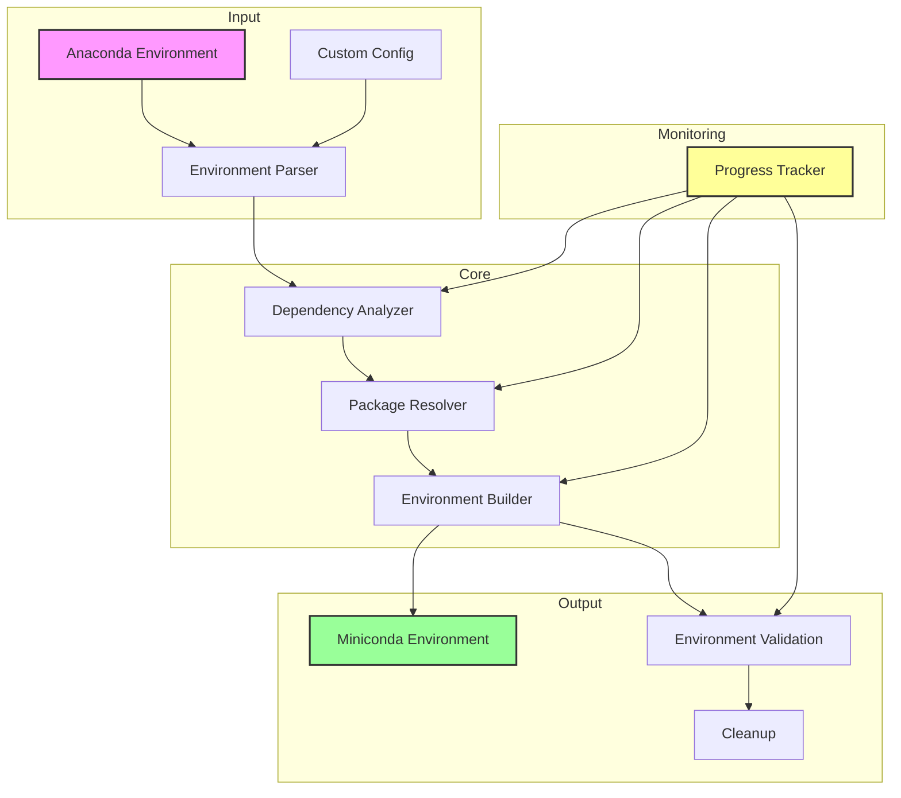
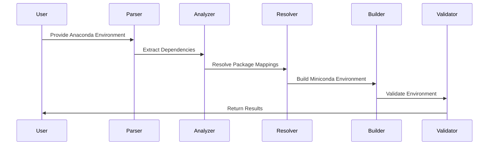
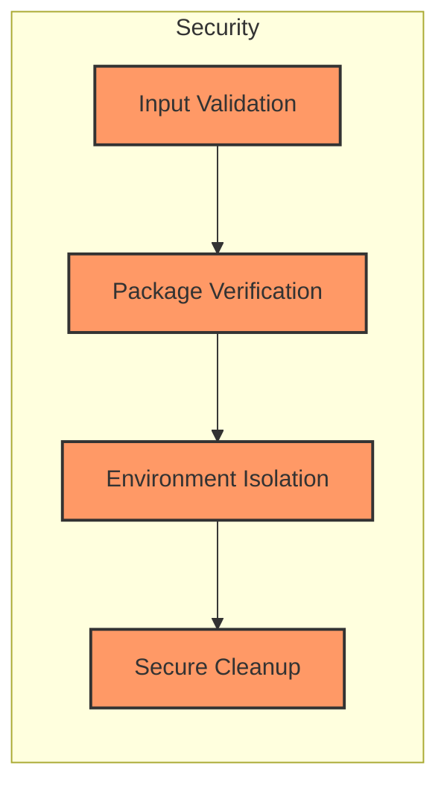

# Architecture

## System Overview

## Component Details

### Input Layer

- **Environment Parser**: Analyzes Anaconda environment files and configurations
- **Custom Config**: Handles user-specific configuration overrides

### Core Layer

- **Dependency Analyzer**: Resolves package dependencies and conflicts
- **Package Resolver**: Maps Anaconda packages to Miniconda equivalents
- **Environment Builder**: Creates new Miniconda environment

### Output Layer

- **Environment Validation**: Verifies converted environment functionality
- **Cleanup**: Manages backup and cleanup of original environment

### Monitoring Layer

- **Progress Tracker**: Provides real-time progress updates and logging

## Data Flow

## Security Considerations

