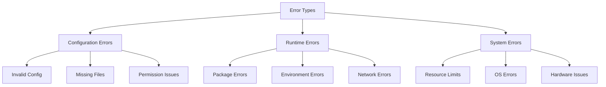

# Error Handling

## Overview

The error handling system provides robust error management, recovery mechanisms, and user feedback for the Conda-Forge Converter.

## Error Categories

## Error Handling Strategy

### 1. Graceful Degradation

- Continue processing when possible
- Skip problematic items
- Maintain partial results
- Provide detailed error reports

### 2. Recovery Mechanisms

- Automatic retries
- Fallback options
- Cleanup procedures
- State recovery

### 3. User Feedback

- Clear error messages
- Actionable suggestions
- Progress indicators
- Detailed logs

## Error Types and Handling

### Configuration Errors

1. **Invalid Configuration**

   - Validate config files
   - Check parameter types
   - Verify file paths
   - Provide correction hints

1. **Missing Files**

   - Check file existence
   - Create if possible
   - Suggest alternatives
   - Log file paths

1. **Permission Issues**

   - Check access rights
   - Request elevation
   - Suggest alternatives
   - Log permission details

### Runtime Errors

1. **Package Errors**

   - Version conflicts
   - Missing packages
   - Dependency issues
   - Resolution failures

1. **Environment Errors**

   - Creation failures
   - Activation issues
   - Path problems
   - State corruption

1. **Network Errors**

   - Connection timeouts
   - Download failures
   - Proxy issues
   - SSL errors

### System Errors

1. **Resource Limits**

   - Memory exhaustion
   - Disk space
   - CPU usage
   - Process limits

1. **OS Errors**

   - File system errors
   - Process management
   - System calls
   - Resource access

1. **Hardware Issues**

   - Disk errors
   - Memory problems
   - Network hardware
   - Power issues

## Error Recovery

### 1. Automatic Recovery

- Retry operations
- Use alternative methods
- Clean up resources
- Restore state

### 2. Manual Recovery

- User intervention
- Manual fixes
- Configuration updates
- Environment repair

### 3. Prevention

- Proactive checks
- Resource monitoring
- State validation
- Backup procedures

## Logging and Monitoring

### 1. Error Logging

- Error details
- Stack traces
- Context information
- User actions

### 2. Performance Monitoring

- Resource usage
- Operation timing
- Error rates
- Recovery success

### 3. Alerting

- Critical errors
- System issues
- Resource warnings
- User notifications

## Best Practices

### 1. Error Prevention

- Input validation
- Resource checks
- State verification
- Configuration validation

### 2. Error Handling

- Clear error messages
- Actionable feedback
- Recovery options
- State preservation

### 3. Error Reporting

- Detailed logs
- Error categorization
- Impact assessment
- Resolution tracking

## Implementation Guidelines

### 1. Code Structure

- Centralized error handling
- Consistent error types
- Clear error hierarchy
- Proper error propagation

### 2. Error Messages

- User-friendly language
- Technical details
- Action suggestions
- Context information

### 3. Testing

- Error scenarios
- Recovery procedures
- Edge cases
- Performance impact
