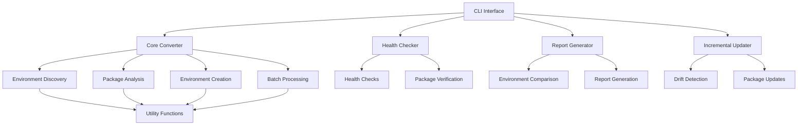

# Design Overview

This document provides a high-level overview of the design principles and architecture of Conda-Forge Converter.

## Design Philosophy

Conda-Forge Converter is designed with the following principles in mind:

1. **Simplicity**: Make environment conversion as straightforward as possible
1. **Reliability**: Ensure converted environments work correctly
1. **Transparency**: Provide clear information about the conversion process
1. **Flexibility**: Support various conversion scenarios and environments
1. **Safety**: Preserve original environments and data

## Architecture Overview

The system follows a modular architecture organized around core components that handle different aspects of the conversion process.

## Core Components

### CLI Interface

The command-line interface provides a user-friendly way to interact with the tool, handling various commands and options.

### Core Converter

The main engine of the application responsible for:

- Discovering conda environments
- Analyzing packages and their relationships
- Creating new conda-forge environments
- Managing batch conversions

### Health Checker

Analyzes environments for potential issues:

- Python version compatibility
- Package conflicts
- Environment size
- Package import verification

### Report Generator

Creates detailed reports about conversions:

- Package changes (added, removed, version-changed)
- Channel distribution
- Migration metrics

### Incremental Updater

Handles maintaining converted environments:

- Detecting differences between environments
- Updating packages selectively
- Adding missing packages

## Technical Decisions

### Top-Level Dependencies

The converter focuses on top-level dependencies (those explicitly installed by the user) rather than all dependencies in the environment. This approach:

- Reduces complexity of dependency resolution
- Allows conda to handle compatibility with conda-forge packages
- Preserves the user's intended environment composition

### Backup Strategy

Before conversion, environment specifications are backed up:

- Creates timestamped backup directories
- Uses `conda env export` to preserve environment state
- Enables restoration if something goes wrong

### Parallel Processing

Batch conversions can run in parallel for better performance:

- Uses Python's ThreadPoolExecutor
- Configurable maximum parallelism
- Prevents system overload

### Error Handling

The application uses a hierarchical approach to error handling:

- Low-level errors are caught and logged in utility functions
- Component-level errors provide meaningful messages
- Application-level errors present user-friendly information

## Data Flow

1. **User Input**: Commands and options via CLI
1. **Environment Discovery**: Finding environments that match criteria
1. **Package Analysis**: Extracting package information
1. **Environment Creation**: Building new conda-forge environments
1. **Verification**: Optional health checks and testing
1. **Reporting**: Generating conversion reports

## Extension Points

The architecture provides several extension points:

1. **Custom Health Checks**: Add new environment health checks
1. **Verification Tests**: Create custom package verification tests
1. **Report Formats**: Support additional report formats
1. **Custom Package Handlers**: Special handling for specific packages

## Future Directions

See the [Planned Improvements](improvements.md) document for details on future architectural enhancements.
