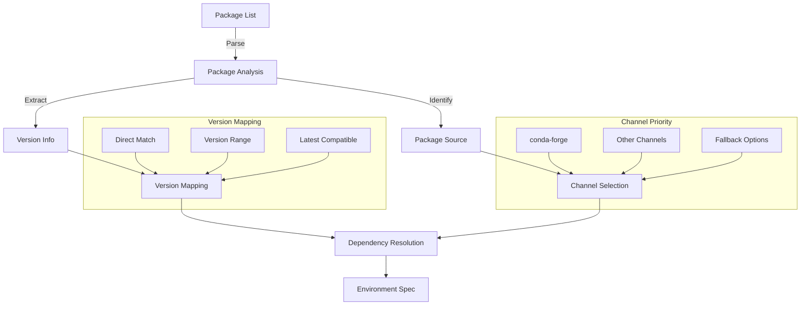

# Package Resolution

## Overview

The package resolution system is responsible for mapping Anaconda packages to their conda-forge equivalents while
maintaining version compatibility and resolving dependencies.

## Resolution Process

## Version Mapping Strategies

### 1. Direct Version Match

- Exact version match in conda-forge
- Preserves original version constraints
- Highest priority resolution

### 2. Version Range Resolution

- Maps to compatible version ranges
- Considers package compatibility
- Handles version constraints

### 3. Latest Compatible Version

- Finds latest version meeting constraints
- Considers dependency compatibility
- Uses semantic versioning rules

## Channel Priority

1. **Primary Channel**

   - conda-forge (default)
   - Highest priority for resolution

1. **Secondary Channels**

   - Other community channels
   - Used when conda-forge not available

1. **Fallback Options**

   - Original channel as last resort
   - pip packages when needed

## Dependency Resolution

### 1. Direct Dependencies

- Immediate package requirements
- Version constraints
- Channel preferences

### 2. Transitive Dependencies

- Indirect package requirements
- Dependency tree analysis
- Conflict resolution

### 3. Optional Dependencies

- Optional package features
- Feature compatibility
- Performance impact

## Resolution Rules

1. **Version Compatibility**

   - Semantic versioning rules
   - Package-specific constraints
   - Python version compatibility

1. **Channel Priority**

   - Channel order importance
   - Package availability
   - Version availability

1. **Conflict Resolution**

   - Dependency conflicts
   - Version conflicts
   - Channel conflicts

## Error Handling

### 1. Resolution Failures

- Package not found
- Version not available
- Dependency conflicts

### 2. Recovery Strategies

- Alternative versions
- Different channels
- Package substitutions

### 3. User Intervention

- Manual version selection
- Channel override
- Package exclusion

## Performance Optimization

### 1. Caching

- Package metadata cache
- Resolution results cache
- Channel index cache

### 2. Parallel Resolution

- Concurrent package resolution
- Batch processing
- Resource utilization

### 3. Incremental Updates

- Delta resolution
- Change detection
- Efficient updates

## Monitoring and Logging

### 1. Resolution Logs

- Package resolution steps
- Version mapping details
- Channel selection reasons

### 2. Performance Metrics

- Resolution time
- Cache hit rates
- Resource usage

### 3. Error Tracking

- Resolution failures
- Conflict patterns
- Common issues
