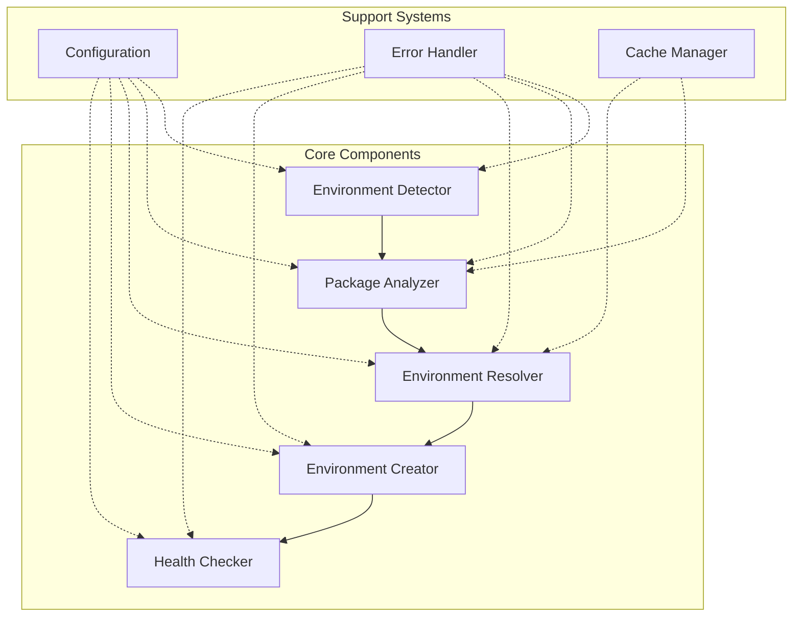
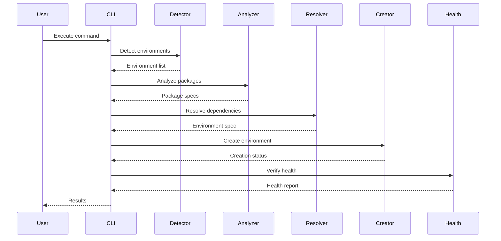
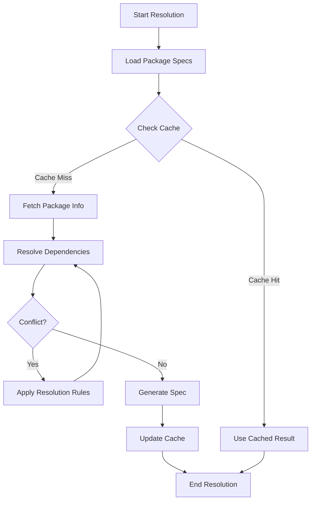
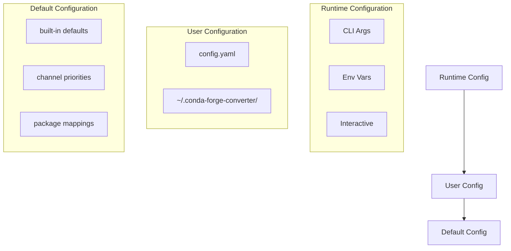
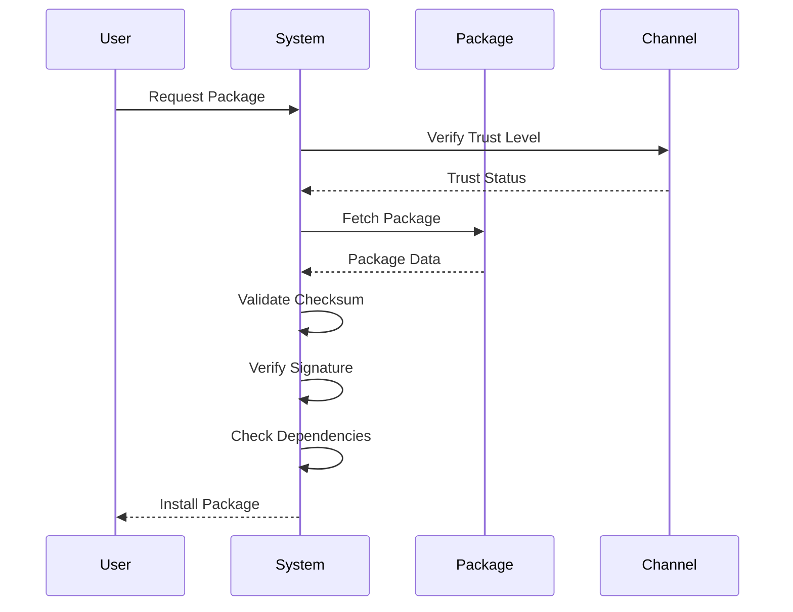

# System Design

## Overview

The Conda-Forge Converter is designed with a modular architecture that separates concerns and enables easy testing and
maintenance. The system follows a pipeline pattern where each stage processes the output of the previous stage.

## Core Components

### 1. Environment Detection (`env_detector.py`)

- Scans for existing Anaconda environments
- Supports pattern matching for batch operations
- Handles environment exclusion logic
- Returns standardized environment metadata

### 2. Package Analysis (`package_analyzer.py`)

- Extracts package information from environments
- Normalizes package specifications
- Identifies package sources (conda vs pip)
- Maps package versions to conda-forge equivalents

### 3. Environment Resolution (`resolver.py`)

- Resolves package dependencies
- Handles version conflicts
- Manages channel priorities
- Generates environment specifications

### 4. Environment Creation (`creator.py`)

- Creates new conda-forge environments
- Installs packages in correct order
- Handles installation failures
- Supports dry-run mode

### 5. Health Verification (`health_check.py`)

- Validates environment integrity
- Tests package imports
- Checks for common issues
- Generates health reports

## Data Flow

## Error Handling

The system implements a robust error handling strategy:

1. **Graceful Degradation**

   - Continues processing when possible
   - Logs errors for later analysis
   - Provides detailed error messages

1. **Recovery Mechanisms**

   - Automatic retry for transient failures
   - Fallback options for package resolution
   - Cleanup of partial environments

1. **Error Categories**

   - Configuration errors
   - Network issues
   - Package conflicts
   - System resource limits

## Configuration

The system uses a hierarchical configuration approach:

1. **Default Configuration**

   - Built-in sensible defaults
   - Standard channel priorities
   - Common package mappings

1. **User Configuration**

   - Custom channel preferences
   - Package version overrides
   - Environment patterns

1. **Runtime Configuration**

   - Command-line arguments
   - Environment variables
   - Interactive prompts

## Performance Considerations

1. **Parallelization**

   - Concurrent environment processing
   - Batch package resolution
   - Parallel health checks

1. **Caching**

   - Package metadata cache
   - Resolution results cache
   - Health check results cache

1. **Resource Management**

   - Memory usage optimization
   - Disk space management
   - Network bandwidth control

## Security

1. **Package Verification**

   - Checksum validation
   - Signature verification
   - Channel trust levels

1. **Environment Isolation**

   - Separate process spaces
   - Resource limits
   - Clean environment creation

## Testing Strategy

1. **Unit Tests**

   - Component-level testing
   - Mock external dependencies
   - Edge case coverage

1. **Integration Tests**

   - End-to-end workflows
   - Real environment testing
   - Performance benchmarks

1. **System Tests**

   - Full system scenarios
   - Error condition testing
   - Resource limit testing

## Package Resolution Flow

## Configuration Hierarchy

## Security Flow

