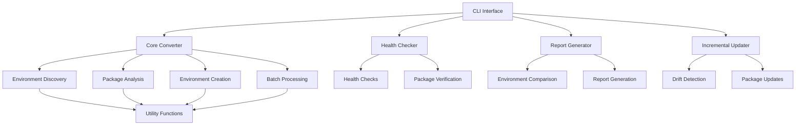

# Architecture Overview

This document provides a detailed overview of the Conda-Forge Converter architecture for developers interested in understanding or contributing to the codebase.

## System Architecture

The Conda-Forge Converter follows a modular architecture organized around core components that handle different aspects of the conversion process.



## Core Components

### CLI Interface (`cli.py`)

The CLI module provides the command-line interface for the tool. It handles:

- Argument parsing
- Command execution
- User interaction
- Error reporting

Key classes and functions:

- `parse_args`: Processes command-line arguments
- `main`: Entry point for the application
- Command handlers for various subcommands

### Core Converter (`core.py`)

The heart of the application that handles the main conversion logic:

- Environment discovery
- Package analysis
- Environment creation
- Batch processing

Key classes and functions:

- `EnvironmentConverter`: Main class for environment conversion
- `discover_environments`: Finds conda environments on the system
- `extract_packages`: Extracts package information from environments
- `create_environment`: Creates new conda-forge environments

### Health Checker (`health.py`)

Analyzes environments for potential issues:

- Python version checking
- Package conflict detection
- Environment size analysis
- Verification tests

Key classes and functions:

- `HealthChecker`: Main class for health checking
- `check_environment`: Performs health checks on an environment
- `verify_packages`: Tests importing key packages

### Report Generator (`reporting.py`)

Generates detailed reports about conversions:

- Package changes
- Channel distributions
- Python version changes
- Channel migration metrics

Key classes and functions:

- `ReportGenerator`: Main class for report generation
- `compare_environments`: Compares two environments
- `generate_report`: Creates detailed report

### Incremental Updater (`incremental.py`)

Handles updating existing environments:

- Drift detection
- Selective updates
- Missing package addition

Key classes and functions:

- `IncrementalUpdater`: Main class for incremental updates
- `detect_drift`: Identifies differences between environments
- `update_packages`: Updates specified packages

### Utilities (`utils.py`)

Common utility functions used across the application:

- Command execution
- Disk space checking
- Logging configuration
- Type definitions

Key classes and functions:

- `run_command`: Executes shell commands
- `check_disk_space`: Verifies available disk space
- `configure_logging`: Sets up logging

## Data Flow

1. **User Input**: Commands and options via CLI
1. **Environment Discovery**: Finding and filtering environments
1. **Package Analysis**: Extracting package information
1. **Environment Creation**: Building new conda-forge environments
1. **Verification**: Optional health checks and testing
1. **Reporting**: Generating conversion reports

## Key Interfaces

### Environment Specification

Environment specifications are represented as structured data:

```python
{
    "name": "environment_name",
    "channels": ["conda-forge", "defaults"],
    "dependencies": [
        "package1=1.0.0",
        "package2=2.0.0",
        {"pip": ["pip_package1==1.0.0"]},
    ],
}
```

### Health Check Reports

Health check results are structured as:

```python
{
    "environment": "environment_name",
    "checks": {
        "python_version": {"status": "pass", "details": "Python 3.9.7"},
        "package_conflicts": {"status": "fail", "details": ["conflict1", "conflict2"]},
        "environment_size": {"status": "warning", "details": "5.2 GB"},
    },
    "verification": {
        "imports": {"status": "pass", "details": ["numpy", "pandas"]},
        "functionality": {"status": "not_run", "details": null},
    },
}
```

### Conversion Reports

Conversion reports include:

```python
{
    "source": "source_env",
    "target": "target_env",
    "packages": {
        "added": ["package1", "package2"],
        "removed": ["package3"],
        "version_changed": {"package4": {"from": "1.0.0", "to": "1.0.1"}},
    },
    "channels": {
        "distribution": {"conda-forge": 95, "defaults": 5},
        "migration": {"percentage": 95, "details": {...}},
    },
}
```

## Error Handling

The application uses a hierarchical error handling approach:

1. **Low-level errors**: Caught in utility functions, logged, and propagated
1. **Component-level errors**: Handled within components, with meaningful error messages
1. **Application-level errors**: Caught in main function, with user-friendly output

Error codes are used to indicate specific types of failures.

## Extension Points

The architecture is designed with several extension points:

1. **Custom Health Checks**: Add new health checks for environments
1. **Verification Tests**: Create custom verification tests for environments
1. **Report Formatters**: Add support for new report formats
1. **Custom Package Handlers**: Handle special cases for specific packages

## Future Architecture Enhancements

Planned architectural improvements include:

1. **Plugin System**: Allow third-party extensions
1. **Configuration Framework**: Provide more flexible configuration options
1. **Caching Layer**: Improve performance for repeated operations
1. **REST API**: Expose functionality through an API for integration
