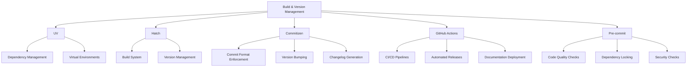
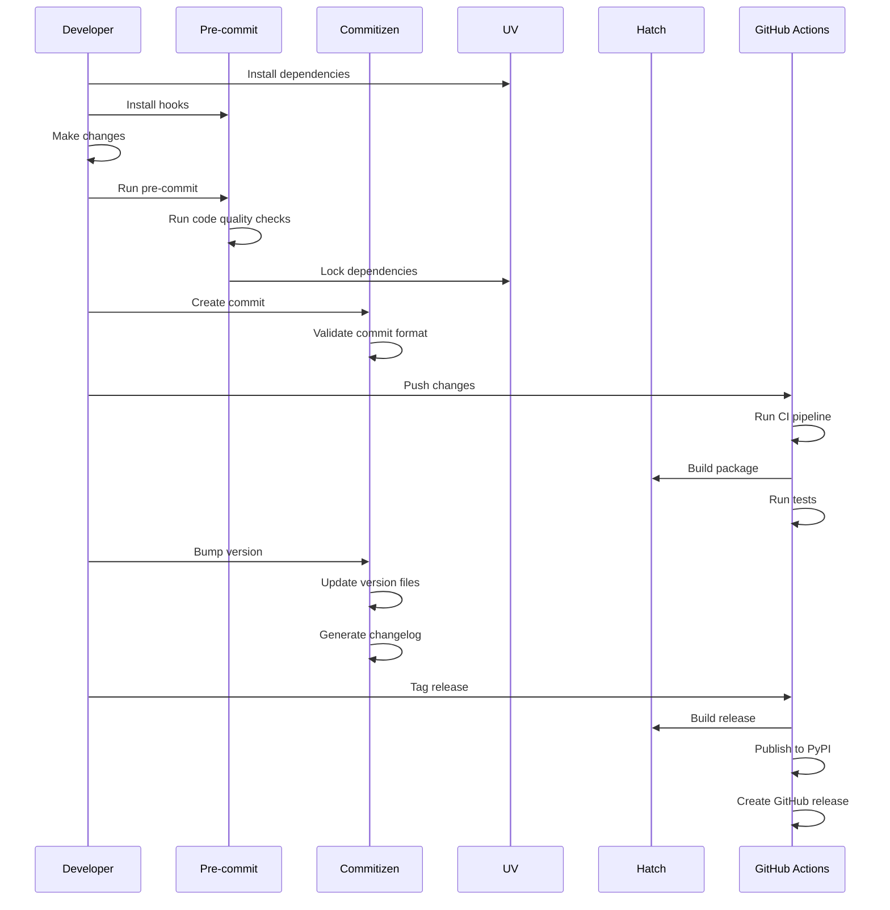

# Build & Version Management Tools

This guide explains the build and version management tools used in the Conda-Forge Converter project, how they work together, and how to use them effectively.

## Overview

We use a comprehensive set of modern Python tools to manage our development workflow:



## UV

[UV](https://github.com/astral-sh/uv) is a fast Python package installer and resolver written in Rust.

### Key Features

- Significantly faster than pip
- Reliable dependency resolution
- Lockfile generation
- Virtual environment management

### Common Commands

```bash
# Install project dependencies
uv pip install -e ".[dev,test]"

# Create a virtual environment
uv venv

# Lock dependencies
uv pip compile pyproject.toml --output-file=requirements.lock --extra=dev --extra=test

# Update dependencies
uv pip compile pyproject.toml --output-file=requirements.lock --extra=dev --extra=test --upgrade
```

### Configuration

UV configuration is specified in `pyproject.toml`:

```toml
# UV configuration for dependency management
# Note: UV doesn't support scripts in pyproject.toml
# Use Hatch for running tests: hatch run test
```

## Hatch

[Hatch](https://hatch.pypa.io/) is a modern, extensible Python project manager and build backend.

### Key Features

- Project management
- Build system
- Version management
- Environment management
- Script running

### Configuration

Hatch configuration is specified in `pyproject.toml`:

```toml
[build-system]
requires = ["hatchling>=1.21.1", "hatch-vcs>=0.4.0"]
build-backend = "hatchling.build"

[tool.hatch.version]
source = "vcs"

[tool.hatch.build.targets.wheel]
packages = ["src/conda_forge_converter"]

[tool.hatch.build.hooks.vcs]
version-file = "src/conda_forge_converter/_version.py"
```

### Common Commands

```bash
# Build the package
hatch build

# Run tests with Hatch
hatch run test:run

# Run tests with coverage
hatch run test

# Create a new environment
hatch env create

# Run a command in a specific environment
hatch -e dev run pytest
```

## Commitizen

[Commitizen](https://commitizen-tools.github.io/commitizen/) is a tool to create standardized commit messages and automate versioning and changelog generation.

### Key Features

- Enforces conventional commit format
- Automates version bumping
- Generates changelogs
- Integrates with pre-commit

### Configuration

Commitizen configuration is specified in `pyproject.toml`:

```toml
[tool.commitizen]
name = "cz_conventional_commits"
tag_format = "v$version"
version_provider = "hatch-vcs"
update_changelog_on_bump = true
version_files = [
    "pyproject.toml:version",
    "src/conda_forge_converter/_version.py:__version__"
]
```

### Common Commands

```bash
# Create a conventional commit
cz commit

# Bump version based on commits
cz bump

# Generate changelog
cz changelog
```

## GitHub Actions

[GitHub Actions](https://github.com/features/actions) is our CI/CD platform for automating workflows.

### Key Workflows

1. **CI Pipeline**: Runs on every push and pull request

   - Runs tests
   - Checks code quality
   - Validates documentation

1. **Release Workflow**: Runs when a tag is pushed

   - Builds the package
   - Publishes to PyPI
   - Creates a GitHub release
   - Deploys documentation

### Configuration

Workflows are defined in `.github/workflows/`:

- `ci.yml`: CI pipeline
- `release.yml`: Release workflow
- `docs.yml`: Documentation deployment

## Pre-commit

[Pre-commit](https://pre-commit.com/) is a framework for managing and maintaining pre-commit hooks.

### Key Features

- Runs checks before commits
- Ensures code quality
- Enforces coding standards
- Automates routine tasks

### Configuration

Pre-commit configuration is specified in `.pre-commit-config.yaml`:

```yaml
repos:
-   repo: https://github.com/pre-commit/pre-commit-hooks
    rev: v5.0.0
    hooks:
    -   id: trailing-whitespace
    -   id: end-of-file-fixer
    # ... more hooks

-   repo: https://github.com/astral-sh/ruff-pre-commit
    rev: v0.11.4
    hooks:
    -   id: ruff
        args: [--fix, --config=pyproject.toml]
    -   id: ruff-format

# ... more repos and hooks
```

### Common Commands

```bash
# Install pre-commit hooks
pre-commit install

# Run pre-commit on all files
pre-commit run --all-files

# Run a specific hook
pre-commit run ruff --all-files
```

## How These Tools Work Together

### Development Workflow Integration

1. **Initial Setup**:

   - Clone repository
   - Install UV and pre-commit
   - Run `uv pip install -e ".[dev,test]"`
   - Run `pre-commit install`

1. **Daily Development**:

   - Make code changes
   - Run `pre-commit run --all-files` to check code quality
   - Use `cz commit` or follow conventional commit format
   - Push changes and create PR

1. **Dependency Management**:

   - Add dependencies to `pyproject.toml`
   - Run `uv run deps-lock` to update lockfile
   - Commit changes

1. **Release Process**:

   - Merge changes to `develop`
   - Create release branch
   - Run `cz bump` to update version
   - Create PR to `main`
   - After merge, tag the release
   - GitHub Actions automates the rest

### Tool Interaction Diagram



## Common Tasks

### Setting Up a New Development Environment

```bash
# Clone repository
git clone https://github.com/yourusername/conda-forge-converter.git
cd conda-forge-converter

# Install tools
pipx install uv
pipx install pre-commit

# Set up development environment
uv pip install -e ".[dev,test]"
pre-commit install
```

### Adding a New Dependency

1. Add the dependency to `pyproject.toml`:

   ```toml
   dependencies = [
       "existing-package>=1.0.0,<2.0.0",
       "new-package>=2.0.0,<3.0.0",  # New dependency
   ]
   ```

1. Lock the dependencies:

   ```bash
   uv run deps-lock
   ```

1. Commit the changes:

   ```bash
   git add pyproject.toml requirements.lock
   cz commit
   ```

### Creating a Release

1. Ensure all changes are merged to `develop`

1. Create a release branch:

   ```bash
   git checkout develop
   git pull
   git checkout -b release/vX.Y.Z
   ```

1. Bump the version:

   ```bash
   cz bump
   ```

1. Create a PR to `main`

1. After merge, tag the release:

   ```bash
   git checkout main
   git pull
   git tag vX.Y.Z
   git push origin vX.Y.Z
   ```

1. GitHub Actions will automatically:

   - Build the package
   - Publish to PyPI
   - Create a GitHub release
   - Deploy documentation

## Troubleshooting

### UV Issues

**Issue**: Dependency resolution conflicts

**Solution**:

```bash
# Clear cache and try again
uv cache clean
uv pip install -e ".[dev,test]"
```

### Pre-commit Issues

**Issue**: Hooks failing

**Solution**:

```bash
# Update hooks
pre-commit autoupdate

# Clean cache
pre-commit clean

# Run again
pre-commit run --all-files
```

### Commitizen Issues

**Issue**: Version bump fails

**Solution**:

```bash
# Check if you have the right commits for a bump
cz changelog --dry-run

# Force a specific bump
cz bump --increment PATCH
```

## Additional Resources

- [UV Documentation](https://github.com/astral-sh/uv)
- [Hatch Documentation](https://hatch.pypa.io/)
- [Commitizen Documentation](https://commitizen-tools.github.io/commitizen/)
- [Pre-commit Documentation](https://pre-commit.com/)
- [GitHub Actions Documentation](https://docs.github.com/en/actions)
