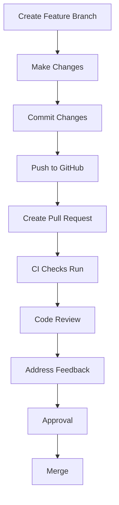

# Pull Request Process

This guide provides a simplified overview of the pull request (PR) process for the Conda-Forge Converter project, from creating a PR to getting it merged.

## Overview

The pull request process follows these general steps:



## 1. Before Creating a Pull Request

Ensure your changes are ready for review:

- ✅ All tests pass locally
- ✅ Pre-commit checks pass
- ✅ Documentation is updated
- ✅ Code follows project style guidelines
- ✅ Commits follow conventional commit format

## 2. Creating a Pull Request

### Step 1: Push Your Branch

Push your feature branch to GitHub:

```bash
git push origin feature/your-feature-name
```

### Step 2: Create the PR on GitHub

1. Go to the repository on GitHub
1. Click "Pull requests" > "New pull request"
1. Select your branch as the compare branch
1. Click "Create pull request"

### Step 3: Fill Out the PR Template

Our PR template includes sections for:

- **Description**: Clear explanation of the changes
- **Related Issues**: Links to related issues
- **Type of Change**: Bug fix, feature, etc.
- **Implementation Details**: How you implemented the changes
- **Testing Performed**: What tests you ran
- **Documentation**: What documentation you updated
- **Checklist**: Verification of quality standards

Example PR description:

```markdown
## Description

This PR adds a new `--verbose` flag to the CLI to provide more detailed output during environment conversion.

## Related Issues

Closes #123

## Type of Change

- [x] New feature (non-breaking change that adds functionality)

## Implementation Details

Added a new option to the CLI parser and implemented verbose logging throughout the conversion process.

## Testing Performed

- [x] Unit tests added
- [x] Manual testing performed
- [x] All tests passing locally

## Documentation

- [x] CLI documentation updated
- [x] Docstrings added
```

## 3. Automated Checks

After creating the PR, several automated checks will run:

- **CI Pipeline**: Runs tests, linting, and type checking
- **Documentation Build**: Ensures documentation builds correctly
- **Dependency Validation**: Checks dependency compatibility

If any checks fail, you'll need to fix the issues before the PR can be merged.

## 4. Code Review Process

### Requesting Reviews

- For most changes, request reviews from at least one team member
- For significant changes, request reviews from multiple team members

### Responding to Feedback

- Address all review comments
- Make requested changes
- Respond to comments to indicate how you addressed them
- Request re-review when changes are complete

### Review Etiquette

- Be respectful and constructive
- Focus on the code, not the person
- Explain the reasoning behind your suggestions
- Provide examples when possible

## 5. Iterating on Your PR

As you address feedback, continue to:

1. Make changes locally
1. Run tests and pre-commit checks
1. Commit changes with conventional commit format
1. Push to your branch

The PR will automatically update, and CI checks will run again.

## 6. Getting Your PR Merged

### Requirements for Merging

- ✅ All CI checks pass
- ✅ Required reviews are approved
- ✅ No unresolved conversations
- ✅ PR is up-to-date with the target branch

### Merge Methods

We use different merge methods depending on the PR type:

- **Squash and merge**: For small, focused PRs (default)
- **Merge commit**: For larger features with multiple meaningful commits
- **Rebase and merge**: For PRs that need to maintain a linear history

The repository maintainers will choose the appropriate merge method.

## 7. After Merging

After your PR is merged:

1. Delete your feature branch (can be done via GitHub UI)
1. Update your local repository:
   ```bash
   git checkout develop
   git pull
   ```
1. Celebrate your contribution! 🎉

## Common PR Issues and Solutions

### PR Conflicts

If your PR has conflicts with the target branch:

1. Update your local copy of the target branch:

   ```bash
   git checkout develop
   git pull
   ```

1. Rebase your feature branch:

   ```bash
   git checkout feature/your-feature-name
   git rebase develop
   ```

1. Resolve conflicts and continue the rebase:

   ```bash
   # After resolving conflicts
   git add .
   git rebase --continue
   ```

1. Force push your updated branch:

   ```bash
   git push --force-with-lease origin feature/your-feature-name
   ```

### Failed CI Checks

If CI checks fail:

1. Review the CI logs to identify the issue
1. Fix the issues locally
1. Run tests and pre-commit checks
1. Commit and push the fixes

### PR Size

If your PR is too large:

1. Consider breaking it into smaller, focused PRs
1. Create a draft PR for early feedback
1. Use feature flags to merge incomplete features

## PR Best Practices

### PR Size

- Keep PRs small and focused on a single change
- Aim for PRs that can be reviewed in 30 minutes or less
- Split large changes into multiple PRs when possible

### PR Description

- Be specific about what changes you made
- Explain why the changes are necessary
- Include screenshots for UI changes
- Link to related issues and documentation

### Commit History

- Use conventional commit format
- Keep commits logical and focused
- Squash fixup commits before merging

### Testing

- Add tests for new functionality
- Update tests for modified functionality
- Include both unit and integration tests when appropriate

## Example PR Workflow

Here's a complete example of a typical PR workflow:

1. **Create a feature branch**:

   ```bash
   git checkout develop
   git pull
   git checkout -b feature/add-verbose-flag
   ```

1. **Make changes and test**:

   ```bash
   # Make code changes
   # Add tests
   # Update documentation
   pytest
   pre-commit run --all-files
   ```

1. **Commit changes**:

   ```bash
   git add .
   git commit -m "feat(cli): add verbose output flag"
   ```

1. **Push branch and create PR**:

   ```bash
   git push origin feature/add-verbose-flag
   # Create PR on GitHub
   ```

1. **Address review feedback**:

   ```bash
   # Make requested changes
   git add .
   git commit -m "refactor(cli): improve verbose output formatting"
   git push origin feature/add-verbose-flag
   ```

1. **After approval, PR is merged by maintainers**

1. **Clean up**:

   ```bash
   git checkout develop
   git pull
   git branch -d feature/add-verbose-flag
   ```

## Additional Resources

- [GitHub's Pull Request Documentation](https://docs.github.com/en/github/collaborating-with-pull-requests)
- [Conventional Commits Guide](conventional-commits.md)
- [Developer Workflow Guide](workflow.md)
