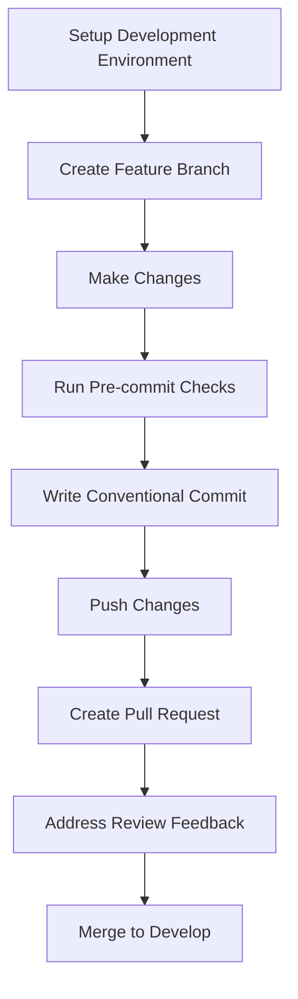

# Developer Workflow Guide

This guide provides a comprehensive walkthrough of the development workflow for the Conda-Forge Converter project, from setting up your environment to submitting pull requests and releasing new versions.

## Overview

The development workflow follows these general steps:



## 1. Setting Up Your Development Environment

### Prerequisites

- Python 3.11 or higher
- Git
- A code editor (VS Code recommended)

### Setup Steps

1. **Clone the Repository**

   ```bash
   git clone https://github.com/yourusername/conda-forge-converter.git
   cd conda-forge-converter
   ```

1. **Install Required Tools**

   We use several tools to manage the development workflow:

   ```bash
   # Install UV for dependency management
   pipx install uv

   # Install pre-commit for automated checks
   pipx install pre-commit
   ```

1. **Set Up Development Environment**

   ```bash
   # Install project dependencies
   uv pip install -e ".[dev,test]"

   # Install pre-commit hooks
   pre-commit install
   ```

## 2. Development Workflow

### Creating a Feature Branch

We follow a modified GitFlow branching strategy:

1. **Update your local copy**

   ```bash
   git checkout develop
   git pull
   ```

1. **Create a feature branch**

   Branch naming conventions:

   - `feature/your-feature-name` for new features
   - `bugfix/issue-description` for bug fixes
   - `docs/documentation-change` for documentation changes
   - `refactor/component-name` for code refactoring

   ```bash
   git checkout -b feature/your-feature-name
   ```

### Making Changes

1. **Write code** following our code style guidelines
1. **Add tests** for new functionality
1. **Update documentation** as needed

### Running Pre-commit Checks

Before committing, run pre-commit checks to ensure code quality:

```bash
# Run pre-commit on all files
pre-commit run --all-files
```

This will automatically:

- Format code with Ruff
- Run linting checks
- Run type checking with Pyright
- Lock dependencies with UV
- Check for security issues
- Validate documentation

### Writing Conventional Commits

We use the [Conventional Commits](https://www.conventionalcommits.org/) standard for commit messages. This is enforced by Commitizen through pre-commit hooks.

Basic format:

```
type(scope): description
```

For example:

```
feat(cli): add new option for verbose output
```

See the [Conventional Commits Guide](conventional-commits.md) for detailed information.

### Pushing Changes

Push your changes to the remote repository:

```bash
git push origin feature/your-feature-name
```

## 3. Pull Request Process

### Creating a Pull Request

1. Go to GitHub and create a PR from your feature branch to the `develop` branch
1. Fill out the PR template with:
   - Description of changes
   - Related issues
   - Type of change
   - Testing performed
   - Documentation updates

### PR Review Process

1. **CI Checks**: Automated checks will run on your PR
1. **Code Review**: Team members will review your code
1. **Address Feedback**: Make requested changes
1. **Approval**: Once approved, your PR can be merged

### Testing GitHub Actions Workflows Locally

If your changes include modifications to GitHub Actions workflows, you should test them locally before submitting a PR:

1. **Validate Syntax**:

   ```bash
   # Using pre-commit
   pre-commit run actionlint --files .github/workflows/ci.yml

   # Or directly
   actionlint .github/workflows/ci.yml
   ```

1. **Test Execution**:

   ```bash
   # Test with default push event
   .github/local-testing/test-workflow.sh .github/workflows/ci.yml

   # Test with specific Python version
   .github/local-testing/test-workflow.sh .github/workflows/ci.yml push python-version=3.11
   ```

1. **Test Matrix Builds**:

   ```bash
   # Test with both Python 3.11 and 3.12
   .github/local-testing/test-python-versions.sh .github/workflows/ci.yml
   ```

For detailed instructions, see the [Testing Guide](testing.md#local-testing-of-github-actions-workflows).

### Merging

PRs are typically merged by maintainers after approval.

## 4. Build and Version Management

Our project uses several tools for build and version management:

- **UV**: Fast Python package installer and resolver
- **Hatch**: Build system and versioning tool
- **Commitizen**: Conventional commit enforcement and version bumping
- **GitHub Actions**: CI/CD pipelines
- **Pre-commit**: Automated checks

See the [Build Tools Guide](build-tools.md) for detailed information.

## 5. Release Process

Releases are managed through a structured process:

1. **Create Release Branch**: `release/vX.Y.Z`
1. **Update Documentation**: Ensure CHANGELOG.md is updated
1. **Review and Testing**: Final checks before release
1. **Tag and Release**: Create git tag and GitHub release
1. **Publish**: Automated publishing to PyPI

See the [Release Process Guide](releasing.md) for detailed information.

## Common Tasks

### Dependency Management

```bash
# Add a new dependency
# 1. Edit pyproject.toml to add the dependency
# 2. Lock dependencies
uv run deps-lock

# Update dependencies
uv run deps-update
```

### Running Tests

```bash
# Run all tests
hatch run test:run

# Run with coverage
hatch run test

# Run specific test file
hatch run test:run tests/test_specific.py
```

### Building Documentation

```bash
# Serve documentation locally
mkdocs serve

# Build documentation
mkdocs build
```

## Troubleshooting

### Pre-commit Issues

If pre-commit hooks fail:

1. Fix the reported issues
1. Run `pre-commit run --all-files` again
1. If you're stuck, check the [Quick Reference Guide](quick-reference.md)

### Dependency Issues

If you encounter dependency conflicts:

1. Update your local copy of the repository
1. Run `uv pip install -e ".[dev,test]"` again
1. If issues persist, check the locked dependencies in `requirements.lock`

## Getting Help

If you need help with the development workflow:

- Check existing documentation
- Ask team members
- Open an issue with the "question" label
