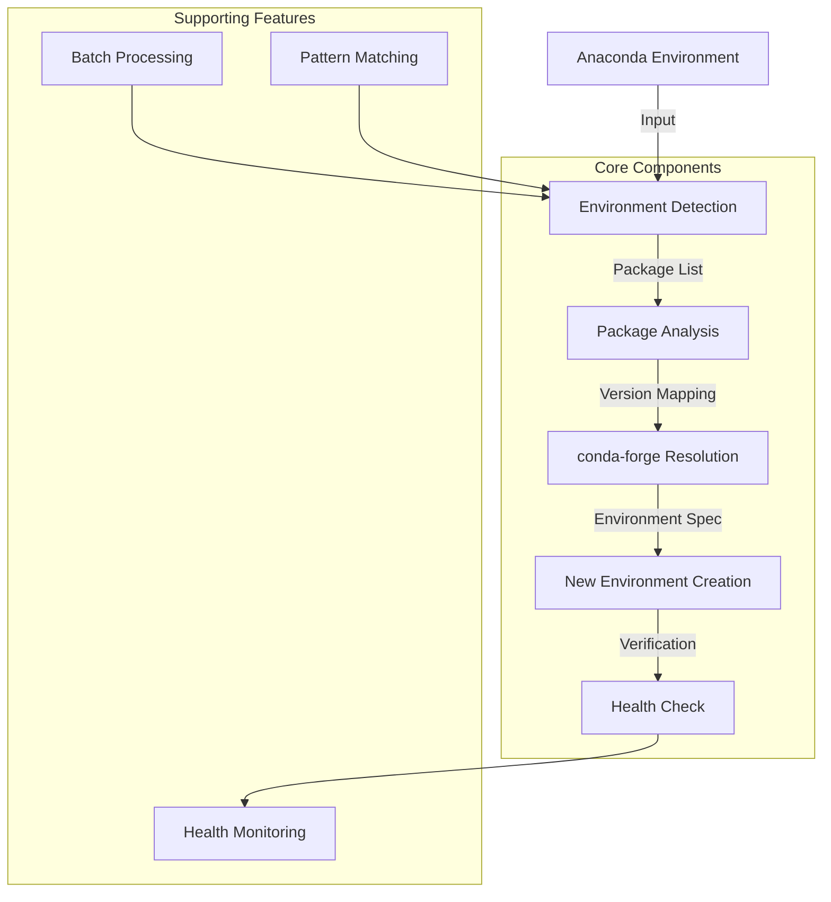

# Conda-Forge Converter

A tool to convert Anaconda environments to conda-forge environments while preserving package versions.

## Architecture



## Key Features

- 🔄 Seamless conversion from Anaconda to conda-forge
- 📦 Preserves package versions and dependencies
- 🔍 Smart package resolution and compatibility checking
- 🚀 Batch processing with pattern matching
- ✅ Environment health verification
- 🔧 Support for both conda and pip packages

## Quick Start

```bash
# Install the package
pip install conda-forge-converter

# Convert a single environment
conda-forge-converter -s myenv -t myenv_forge

# Batch convert environments
conda-forge-converter --batch --pattern "data*"
```

## Documentation Sections

### User Guide

- [Getting Started](user/getting-started.md)
- [CLI Reference](user/cli-reference.md)
- [Common Workflows](user/workflows.md)
- [Troubleshooting](user/troubleshooting.md)

### Developer Guide

- [Architecture](dev/architecture.md)
- [Contributing](CONTRIBUTING.md)
- [Development Setup](dev/setup.md)
- [Testing](dev/testing.md)

### Design & Architecture

- [System Design](design/system-design.md)
- [Package Resolution](design/package-resolution.md)
- [Error Handling](design/error-handling.md)

## Why Use conda-forge?

- 🏢 Community-maintained packages
- 🔄 More up-to-date package versions
- 🧩 Better dependency resolution
- 📚 Broader package selection
- 🛠️ Active maintenance and support

## Project Status

See our [TODO list](TODO.md) for current development status and planned features.
