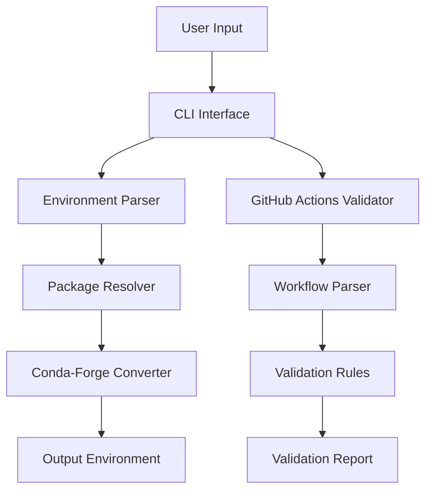

# Conda-Forge Converter

A tool for converting Anaconda environments to conda-forge and validating GitHub Actions workflows.

## Features

- Convert Anaconda environments to conda-forge
- Validate GitHub Actions workflows
- Comprehensive test coverage
- Modern Python tooling and best practices

## Quick Start

```bash
# Install with pip
pip install conda-forge-converter

# Or install with uv (recommended)
uv pip install conda-forge-converter
```

For detailed installation instructions, see the [Installation Guide](user/getting-started.md).

## Project Status

[](https://github.com/ricea/anaconda-to-miniconda2/actions/workflows/ci.yml)
[](https://codecov.io/gh/ricea/anaconda-to-miniconda2)
[](https://ricea.github.io/anaconda-to-miniconda2/)
[](https://badge.fury.io/py/conda-forge-converter)
[](https://github.com/ricea/anaconda-to-miniconda2/blob/main/LICENSE)

## Architecture



## Contributing

We welcome contributions! Please see our [Contributing Guide](dev/contributing.md) for details.

## Key Features

- 🔄 Seamless conversion from Anaconda to conda-forge
- 📦 Preserves package versions and dependencies
- 🔍 Smart package resolution and compatibility checking
- 🚀 Batch processing with pattern matching
- ✅ Environment health verification
- 🔧 Support for both conda and pip packages

## Documentation Sections

### User Guide

- [Getting Started](user/faq.md)
- [CLI Reference](user/faq.md#usage)
- [Common Workflows](user/faq.md#common-workflows)
- [Troubleshooting](user/troubleshooting.md)

### Developer Guide

- [Architecture](architecture.md)
- [Contributing](dev/contributing.md)
- [Development Setup](dev/setup.md)
- [Testing](dev/testing.md)

### Design & Architecture

- [System Design](design/system-design.md)
- [Package Resolution](design/package-resolution.md)
- [Error Handling](design/error-handling.md)

## Why Use conda-forge?

- 🏢 Community-maintained packages
- 🔄 More up-to-date package versions
- 🧩 Better dependency resolution
- 📚 Broader package selection
- 🛠️ Active maintenance and support
