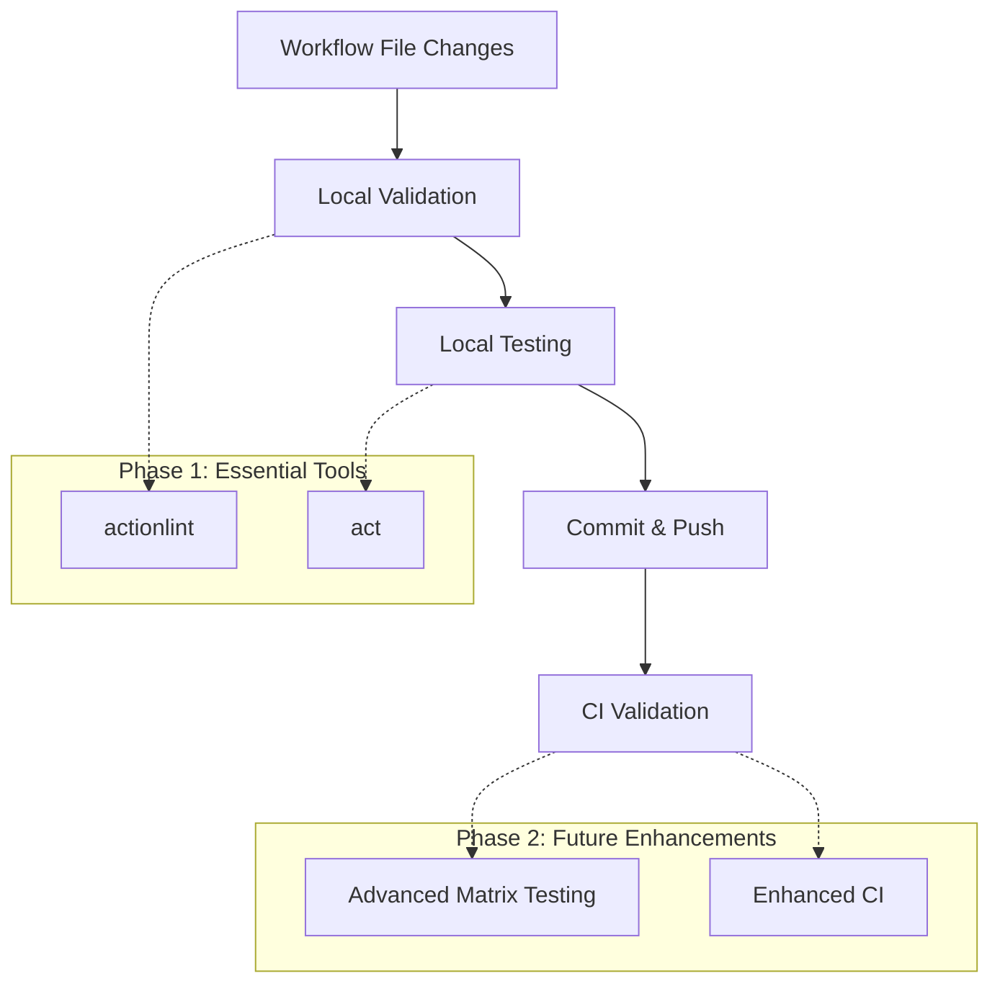

# GitHub Actions Local Testing Plan

This document outlines a comprehensive plan for testing GitHub Actions workflows locally before committing changes, with a focus on matrix builds and different Python versions.

## Table of Contents

- [Overview](#overview)
- [Implementation Plan](#implementation-plan)
- [Setup Instructions](#setup-instructions)
  - [Basic Setup](#basic-setup)
  - [Windows Setup Guide](#windows-setup-guide)
- [Usage Guide](#usage-guide)
  - [Basic Validation](#basic-validation)
  - [Local Testing](#local-testing)
  - [Testing Python Versions](#testing-python-versions)
  - [Example: Testing CI Workflow](#example-testing-ci-workflow)
- [CI Validation](#ci-validation)
- [Future Enhancements](#future-enhancements)

## Overview

This plan provides a streamlined approach to test GitHub Actions workflows locally before committing changes. It focuses on:

1. **Syntax validation** using actionlint (leveraging existing pre-commit hooks)
1. **Local execution testing** using act
1. **Matrix testing** for Python 3.11 and 3.12
1. **CI validation** for pull requests
1. **Developer-friendly setup** for Windows 11, VSCode, and Docker Desktop



## Implementation Plan

### Day 1: Basic Setup (4-5 hours)

1. Create the `.github/local-testing` directory
1. Create the `.github/local-testing/events` directory
1. Create the test-workflow.sh script with matrix support
1. Create the test-python-versions.sh script
1. Create the .actrc file
1. Create the .vscode/tasks.json file
1. Make the scripts executable
1. Create the README.md file with examples

### Day 2: CI Validation (2-3 hours)

1. Create the `.github/workflows/validate-workflows.yml` file
1. Test it by creating a PR with workflow changes
1. Refine as needed

### Day 3: Testing and Documentation (2-3 hours)

1. Test the scripts with your CI workflow
1. Test with Python 3.11 and 3.12
1. Update documentation with specific examples
1. Share with the team

## Setup Instructions

### Basic Setup

1. Create the directory structure:

```bash
mkdir -p .github/local-testing/events
```

2. Create the test-workflow.sh script:

```bash
#!/bin/bash
# .github/local-testing/test-workflow.sh

WORKFLOW_FILE=$1
EVENT_TYPE=${2:-push}
MATRIX_OVERRIDE=$3

if [ -z "$WORKFLOW_FILE" ]; then
  echo "Usage: $0 <workflow-file> [event-type] [matrix-override]"
  echo "Examples:"
  echo "  $0 .github/workflows/ci.yml"
  echo "  $0 .github/workflows/ci.yml pull_request"
  echo "  $0 .github/workflows/ci.yml push python-version=3.11"
  exit 1
fi

# Create events directory if it doesn't exist
mkdir -p .github/local-testing/events

# Create a simple event file if it doesn't exist
if [ ! -f ".github/local-testing/events/$EVENT_TYPE.json" ]; then
  echo "Creating sample $EVENT_TYPE event..."
  echo '{
    "event_type": "'$EVENT_TYPE'"
  }' > .github/local-testing/events/$EVENT_TYPE.json
fi

# Handle matrix override
if [ -n "$MATRIX_OVERRIDE" ]; then
  echo "Using matrix override: $MATRIX_OVERRIDE"

  # Create a temporary JSON file for matrix inputs
  echo "{" > .github/local-testing/matrix-input.json

  # Parse matrix arguments
  IFS='=' read -r key value <<< "$MATRIX_OVERRIDE"
  echo "  \"$key\": \"$value\"" >> .github/local-testing/matrix-input.json

  # Close the JSON
  echo "}" >> .github/local-testing/matrix-input.json

  # Run with matrix override
  echo "Testing workflow: $WORKFLOW_FILE with event: $EVENT_TYPE and matrix: $MATRIX_OVERRIDE"
  act -W "$WORKFLOW_FILE" -e .github/local-testing/events/$EVENT_TYPE.json --input-file .github/local-testing/matrix-input.json
else
  # Run without matrix override
  echo "Testing workflow: $WORKFLOW_FILE with event: $EVENT_TYPE"
  act -W "$WORKFLOW_FILE" -e .github/local-testing/events/$EVENT_TYPE.json
fi
```

3. Create the test-python-versions.sh script:

```bash
#!/bin/bash
# .github/local-testing/test-python-versions.sh

WORKFLOW_FILE=$1
EVENT_TYPE=${2:-push}

if [ -z "$WORKFLOW_FILE" ]; then
  echo "Usage: $0 <workflow-file> [event-type]"
  echo "Example: $0 .github/workflows/ci.yml pull_request"
  exit 1
fi

echo "Testing workflow with Python 3.11..."
.github/local-testing/test-workflow.sh "$WORKFLOW_FILE" "$EVENT_TYPE" "python-version=3.11"

echo ""
echo "Testing workflow with Python 3.12..."
.github/local-testing/test-workflow.sh "$WORKFLOW_FILE" "$EVENT_TYPE" "python-version=3.12"
```

4. Make the scripts executable:

```bash
chmod +x .github/local-testing/test-workflow.sh
chmod +x .github/local-testing/test-python-versions.sh
```

5. Create the .actrc file:

```
# .actrc
-P ubuntu-latest=ghcr.io/catthehacker/ubuntu:act-latest
-P ubuntu-22.04=ghcr.io/catthehacker/ubuntu:act-22.04
-P ubuntu-20.04=ghcr.io/catthehacker/ubuntu:act-20.04
```

6. Create the .vscode/tasks.json file:

```json
{
    "version": "2.0.0",
    "tasks": [
        {
            "label": "Validate Workflow",
            "type": "shell",
            "command": "actionlint ${input:workflowFile}",
            "problemMatcher": [],
            "presentation": {
                "reveal": "always",
                "panel": "new"
            }
        },
        {
            "label": "Test Workflow",
            "type": "shell",
            "command": "bash .github/local-testing/test-workflow.sh ${input:workflowFile} ${input:eventType}",
            "problemMatcher": [],
            "presentation": {
                "reveal": "always",
                "panel": "new"
            }
        },
        {
            "label": "Test with Python 3.11",
            "type": "shell",
            "command": "bash .github/local-testing/test-workflow.sh ${input:workflowFile} push python-version=3.11",
            "problemMatcher": [],
            "presentation": {
                "reveal": "always",
                "panel": "new"
            }
        },
        {
            "label": "Test with Python 3.12",
            "type": "shell",
            "command": "bash .github/local-testing/test-workflow.sh ${input:workflowFile} push python-version=3.12",
            "problemMatcher": [],
            "presentation": {
                "reveal": "always",
                "panel": "new"
            }
        },
        {
            "label": "Test Both Python Versions",
            "type": "shell",
            "command": "bash .github/local-testing/test-python-versions.sh ${input:workflowFile}",
            "problemMatcher": [],
            "presentation": {
                "reveal": "always",
                "panel": "new"
            }
        }
    ],
    "inputs": [
        {
            "id": "workflowFile",
            "description": "Workflow file path:",
            "default": ".github/workflows/ci.yml",
            "type": "promptString"
        },
        {
            "id": "eventType",
            "description": "Event type:",
            "default": "push",
            "type": "pickString",
            "options": ["push", "pull_request", "workflow_dispatch"]
        }
    ]
}
```

7. Create a README.md file:

````markdown
# GitHub Actions Local Testing

This directory contains tools for testing GitHub Actions workflows locally before committing.

## Prerequisites

1. Install Docker: https://docs.docker.com/get-docker/
2. Install act: https://github.com/nektos/act#installation
3. Install actionlint: https://github.com/rhysd/actionlint#installation

## Usage

### Validate a workflow

```bash
# Using pre-commit
pre-commit run actionlint --files .github/workflows/ci.yml

# Or directly with actionlint
actionlint .github/workflows/ci.yml
````

### Test a workflow locally

```bash
# Test with default push event
.github/local-testing/test-workflow.sh .github/workflows/ci.yml

# Test with pull_request event
.github/local-testing/test-workflow.sh .github/workflows/ci.yml pull_request
```

### Test with specific Python versions

```bash
# Test with Python 3.11
.github/local-testing/test-workflow.sh .github/workflows/ci.yml push python-version=3.11

# Test with Python 3.12
.github/local-testing/test-workflow.sh .github/workflows/ci.yml push python-version=3.12

# Test with both Python 3.11 and 3.12
.github/local-testing/test-python-versions.sh .github/workflows/ci.yml
```

## Example: Testing CI Workflow

Our CI workflow uses a matrix to test against multiple Python versions and operating systems. Here's how to test it locally:

```bash
# Test the entire workflow
.github/local-testing/test-workflow.sh .github/workflows/ci.yml

# Test with Python 3.11
.github/local-testing/test-workflow.sh .github/workflows/ci.yml push python-version=3.11

# Test with Python 3.12
.github/local-testing/test-workflow.sh .github/workflows/ci.yml push python-version=3.12

# Test with both Python versions
.github/local-testing/test-python-versions.sh .github/workflows/ci.yml
```

## Docker Security Tips

1. Keep Docker updated
1. Run act with `--privileged=false`
1. Don't commit secrets to your repository

````

### Windows Setup Guide

For developers using Windows 11, VSCode, and Docker Desktop, follow this setup guide:

```markdown
# Developer Setup Guide for GitHub Actions Local Testing

This guide will help you set up your local environment for testing GitHub Actions workflows using VSCode, Windows 11, and Docker Desktop.

## Prerequisites

- Windows 11
- VSCode
- Docker Desktop
- Git for Windows

## Step 1: Install Docker Desktop

1. Download Docker Desktop for Windows from [https://www.docker.com/products/docker-desktop](https://www.docker.com/products/docker-desktop)
2. Run the installer and follow the prompts
3. Ensure WSL 2 is enabled when prompted
4. After installation, start Docker Desktop
5. Verify Docker is running by opening a terminal and running:
````

docker --version

````

## Step 2: Install Required Tools in VSCode

1. Open VSCode
2. Install the following extensions:
- Docker (ms-azuretools.vscode-docker)
- GitHub Actions (github.vscode-github-actions)
- YAML (redhat.vscode-yaml)
- Remote - WSL (ms-vscode-remote.remote-wsl) (optional, for WSL users)

3. Open the terminal in VSCode (Terminal > New Terminal)

4. Install actionlint:
```powershell
# Using Chocolatey (install Chocolatey first if you don't have it)
choco install actionlint

# Or using Scoop
scoop install actionlint

# Or download the binary directly
Invoke-WebRequest -Uri "https://github.com/rhysd/actionlint/releases/latest/download/actionlint_windows_amd64.zip" -OutFile "actionlint.zip"
Expand-Archive -Path "actionlint.zip" -DestinationPath "$env:USERPROFILE\actionlint"
$env:PATH += ";$env:USERPROFILE\actionlint"
[Environment]::SetEnvironmentVariable("PATH", $env:PATH, "User")
````

5. Install act:

   ```powershell
   # Using Chocolatey
   choco install act-cli

   # Or using Scoop
   scoop install act

   # Or download the binary directly
   Invoke-WebRequest -Uri "https://github.com/nektos/act/releases/latest/download/act_Windows_x86_64.zip" -OutFile "act.zip"
   Expand-Archive -Path "act.zip" -DestinationPath "$env:USERPROFILE\act"
   $env:PATH += ";$env:USERPROFILE\act"
   [Environment]::SetEnvironmentVariable("PATH", $env:PATH, "User")
   ```

1. Install pre-commit:

   ```powershell
   pip install pre-commit
   ```

## Step 3: Configure Docker Desktop

1. Open Docker Desktop
1. Go to Settings > Resources
1. Allocate sufficient resources:
   - CPUs: at least 2
   - Memory: at least 4 GB
   - Swap: at least 1 GB
   - Disk image size: at least 60 GB
1. Go to Settings > Docker Engine
1. Add the following configuration to improve performance:
   ```json
   {
     "experimental": true,
     "features": {
       "buildkit": true
     },
     "builder": {
       "gc": {
         "enabled": true,
         "defaultKeepStorage": "20GB"
       }
     }
   }
   ```
1. Click "Apply & Restart"

## Step 4: Clone the Repository and Set Up Local Testing

1. Clone the repository in VSCode:

   ```powershell
   git clone https://github.com/yourusername/your-repo.git
   cd your-repo
   ```

1. Install pre-commit hooks:

   ```powershell
   pre-commit install
   ```

1. Create the local testing directory structure:

   ```powershell
   mkdir -p .github/local-testing/events
   ```

1. Create the `.actrc` file in the repository root:

   ```
   -P ubuntu-latest=ghcr.io/catthehacker/ubuntu:act-latest
   -P ubuntu-22.04=ghcr.io/catthehacker/ubuntu:act-22.04
   -P ubuntu-20.04=ghcr.io/catthehacker/ubuntu:act-20.04
   ```

1. Create the test scripts:

   - Create `.github/local-testing/test-workflow.sh`
   - Create `.github/local-testing/test-python-versions.sh`
   - Make them executable (not needed on Windows, but good for cross-platform compatibility)

## Step 5: Windows-Specific Configuration

### Using Git Bash

For the best experience with shell scripts, use Git Bash:

1. In VSCode, open settings (File > Preferences > Settings)
1. Search for "terminal.integrated.defaultProfile.windows"
1. Set it to "Git Bash"
1. Restart VSCode

### Path Conversion

Windows uses backslashes, but our scripts expect forward slashes. When running commands, use forward slashes:

```bash
# Correct
./github/local-testing/test-workflow.sh .github/workflows/ci.yml

# Incorrect
.\github\local-testing\test-workflow.sh .github\workflows\ci.yml
```

### Running Shell Scripts on Windows

To run the shell scripts on Windows:

1. Using Git Bash in VSCode terminal:

   ```bash
   bash .github/local-testing/test-workflow.sh .github/workflows/ci.yml
   ```

1. Or create PowerShell wrapper scripts:

   ```powershell
   # test-workflow.ps1
   param(
       [Parameter(Mandatory=$true)][string]$WorkflowFile,
       [string]$EventType = "push",
       [string]$MatrixOverride = ""
   )

   bash .github/local-testing/test-workflow.sh $WorkflowFile $EventType $MatrixOverride
   ```

   Then use:

   ```powershell
   .\test-workflow.ps1 .github/workflows/ci.yml
   ```

## Step 6: Troubleshooting Common Issues

### Docker Connection Issues

If you see "Cannot connect to the Docker daemon" errors:

1. Ensure Docker Desktop is running
1. Try restarting Docker Desktop
1. Check if you need to run as Administrator

### WSL 2 Issues

If you're using WSL 2 and encounter issues:

1. Ensure WSL 2 is properly installed:

   ```powershell
   wsl --status
   ```

1. Update WSL 2 if needed:

   ```powershell
   wsl --update
   ```

1. Ensure Docker Desktop is configured to use WSL 2:

   - Open Docker Desktop > Settings > General
   - Ensure "Use the WSL 2 based engine" is checked

### Act Permission Issues

If act has permission issues accessing Docker:

1. Run Docker Desktop as Administrator
1. Run VSCode as Administrator
1. Or add your user to the docker-users group:
   ```powershell
   net localgroup docker-users $env:USERNAME /add
   ```

### Large Image Downloads

The first time you run act, it will download Docker images which can be large:

1. Ensure you have a good internet connection
1. Be patient during the first run
1. Consider running this during off-hours if you have limited bandwidth

## Step 7: Testing Your Setup

Verify your setup is working correctly:

1. Validate a workflow:

   ```bash
   actionlint .github/workflows/ci.yml
   ```

1. Test a workflow:

   ```bash
   bash .github/local-testing/test-workflow.sh .github/workflows/ci.yml
   ```

1. Test with Python 3.11:

   ```bash
   bash .github/local-testing/test-workflow.sh .github/workflows/ci.yml push python-version=3.11
   ```

## Example: Testing CI Workflow on Windows

```bash
# Using Git Bash
bash .github/local-testing/test-workflow.sh .github/workflows/ci.yml

# Test with Python 3.11
bash .github/local-testing/test-workflow.sh .github/workflows/ci.yml push python-version=3.11

# Test with Python 3.12
bash .github/local-testing/test-workflow.sh .github/workflows/ci.yml push python-version=3.12

# Test both Python versions
bash .github/local-testing/test-python-versions.sh .github/workflows/ci.yml
```

````

## Usage Guide

### Basic Validation

To validate a workflow file:

```bash
# Using pre-commit
pre-commit run actionlint --files .github/workflows/ci.yml

# Or directly with actionlint
actionlint .github/workflows/ci.yml
````

### Local Testing

To test a workflow locally:

```bash
# Test with default push event
.github/local-testing/test-workflow.sh .github/workflows/ci.yml

# Test with pull_request event
.github/local-testing/test-workflow.sh .github/workflows/ci.yml pull_request
```

### Testing Python Versions

To test with specific Python versions:

```bash
# Test with Python 3.11
.github/local-testing/test-workflow.sh .github/workflows/ci.yml push python-version=3.11

# Test with Python 3.12
.github/local-testing/test-workflow.sh .github/workflows/ci.yml push python-version=3.12

# Test with both Python 3.11 and 3.12
.github/local-testing/test-python-versions.sh .github/workflows/ci.yml
```

### Example: Testing CI Workflow

Our CI workflow uses a matrix to test against multiple Python versions and operating systems. Here's how to test it locally:

```bash
# Test the entire workflow
.github/local-testing/test-workflow.sh .github/workflows/ci.yml

# Test with Python 3.11
.github/local-testing/test-workflow.sh .github/workflows/ci.yml push python-version=3.11

# Test with Python 3.12
.github/local-testing/test-workflow.sh .github/workflows/ci.yml push python-version=3.12

# Test with both Python versions
.github/local-testing/test-python-versions.sh .github/workflows/ci.yml
```

## CI Validation

Create a CI workflow to validate workflow files on pull requests:

````yaml
# .github/workflows/validate-workflows.yml
name: Validate Workflows

on:
  pull_request:
    paths:
      - '.github/workflows/**'

jobs:
  validate:
    name: Validate GitHub Actions Workflows
    runs-on: ubuntu-latest
    steps:
      - name: Checkout code
        uses: actions/checkout@v4

      - name: Install actionlint
        run: |
          curl -sSL https://raw.githubusercontent.com/rhysd/actionlint/main/scripts/download-actionlint.bash | bash
          echo "${GITHUB_WORKSPACE}/.actionlint" >> $GITHUB_PATH

      - name: Get changed workflow files
        id: changed-files
        uses: tj-actions/changed-files@v42
        with:
          files: .github/workflows/**/*.yml

      - name: Validate changed workflows
        if: steps.changed-files.outputs.any_changed == 'true'
        run: |
          echo "Validating changed workflow files:"
          echo "${{ steps.changed-files.outputs.all_changed_files }}"
          actionlint ${{ steps.changed-files.outputs.all_changed_files }}

      - name: Comment on PR
        if: steps.changed-files.outputs.any_changed == 'true'
        uses: actions/github-script@v7
        with:
          script: |
            const changedFiles = '${{ steps.changed-files.outputs.all_changed_files }}'.split(' ');

            let comment = '## Workflow Validation\n\n';
            comment += '✅ All workflows passed validation!\n\n';
            comment += 'Validated files:\n';
            changedFiles.forEach(file => {
              comment += `- ${file}\n`;
            });

            comment += '\nRemember to test these workflows locally before merging:\n';
            comment += '```bash\n';
            comment += '.github/local-testing/test-workflow.sh ' + changedFiles[0] + '\n';
            comment += '```\n';

            github.rest.issues.createComment({
              issue_number: context.issue.number,
              owner: context.repo.owner,
              repo: context.repo.repo,
              body: comment
            });
````

## Future Enhancements

Once the team is comfortable with the basic setup, consider these future enhancements:

1. **Advanced Matrix Testing**: Develop a more sophisticated matrix testing tool that can:

   - Automatically extract matrix configurations from workflow files
   - Generate all possible combinations
   - Allow testing specific combinations
   - Provide a report of tested configurations

1. **Enhanced CI Validation**:

   - Add parallel processing for large PRs
   - Add more comprehensive validation checks
   - Add performance metrics
   - Add integration with other CI tools

1. **Mock Services**:

   - Create mock implementations of external services
   - Add support for testing workflows that interact with external APIs
   - Create a library of common mock responses

1. **Reporting and Visualization**:

   - Add reporting of test results
   - Create visualizations of workflow execution
   - Add performance metrics and trends

These enhancements can be implemented incrementally as the team becomes more comfortable with the basic workflow testing process.
