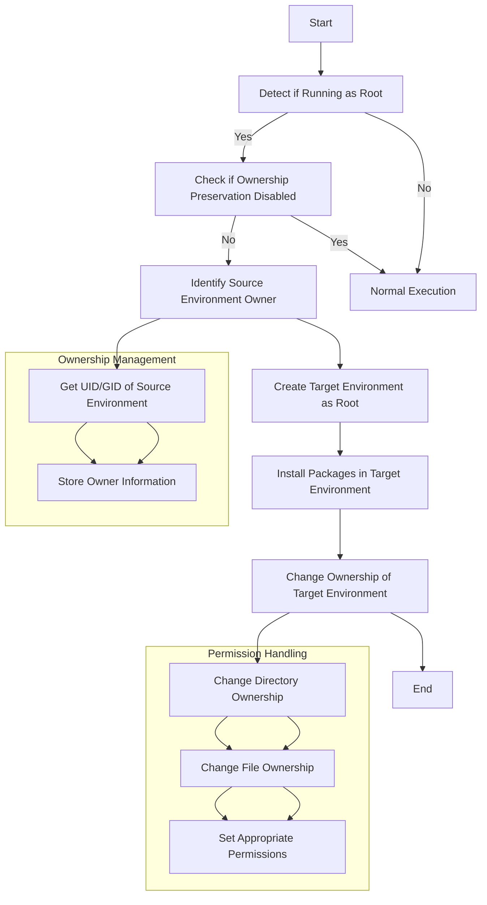

# Implementation Plan: Root User Support with Ownership Preservation

## Overview

This document outlines the implementation plan for adding support to run the conda-forge-converter as a root user on Linux servers while preserving environment ownership.



## Requirements

1. Run on a Linux server as a root user
1. Change environments owned by any user on the OS
1. Ensure the conda forge environment has the same ownership as the original anaconda environment
1. Provide an option to disable automatic ownership preservation

## Implementation Details

### 1. Add Ownership Management Functions to `utils.py`

```python
# In utils.py
import os
import pwd
import grp
from pathlib import Path
from typing import Tuple, Optional


def is_root() -> bool:
    """Check if the current process is running as root.

    Returns:
        True if running as root, False otherwise
    """
    return os.geteuid() == 0


def get_path_owner(path: PathLike) -> Tuple[int, int]:
    """Get the user and group IDs of a file or directory.

    Args:
        path: Path to the file or directory

    Returns:
        Tuple of (uid, gid)
    """
    path_obj = Path(path)
    stat_info = path_obj.stat()
    return (stat_info.st_uid, stat_info.st_gid)


def get_owner_names(uid: int, gid: int) -> Tuple[str, str]:
    """Get the user and group names from their IDs.

    Args:
        uid: User ID
        gid: Group ID

    Returns:
        Tuple of (username, groupname)
    """
    try:
        username = pwd.getpwuid(uid).pw_name
        groupname = grp.getgrgid(gid).gr_name
        return (username, groupname)
    except KeyError:
        logger.warning(f"Could not find user/group for UID={uid}, GID={gid}")
        return ("unknown", "unknown")


def change_path_owner(
    path: PathLike, uid: int, gid: int, recursive: bool = True
) -> bool:
    """Change the owner of a file or directory.

    Args:
        path: Path to the file or directory
        uid: User ID to set as owner
        gid: Group ID to set as group
        recursive: Whether to change ownership recursively for directories

    Returns:
        True if successful, False otherwise
    """
    path_obj = Path(path)

    try:
        if not recursive or path_obj.is_file():
            os.chown(path_obj, uid, gid)
        else:
            # Recursively change ownership of all files and directories
            for root, dirs, files in os.walk(path_obj):
                root_path = Path(root)
                os.chown(root_path, uid, gid)
                for file in files:
                    file_path = root_path / file
                    os.chown(file_path, uid, gid)
        return True
    except (PermissionError, OSError) as e:
        logger.error(f"Failed to change ownership of {path}: {str(e)}")
        return False
```

### 2. Update CLI Interface in `cli.py`

Add a new command-line option to disable automatic ownership preservation:

```python
# In cli.py
def parse_args(args: Sequence[str] | None = None) -> argparse.Namespace:
    """Parse command-line arguments."""
    # [existing code...]

    # Add new option for disabling ownership preservation
    parser.add_argument(
        "--no-preserve-ownership",
        action="store_true",
        help="Disable automatic preservation of source environment ownership when running as root",
    )

    # [rest of existing code...]

    return parser.parse_args(args)
```

### 3. Modify Environment Creation Process in `core.py`

Update the environment creation process to handle ownership transfer:

```python
# In core.py
def create_conda_forge_environment(
    source_env: str,
    target_env: str,
    conda_packages: CondaPackages,
    pip_packages: PipPackages,
    python_version: str | None = None,
    dry_run: bool = False,
    verbose: bool = False,
    use_fast_solver: bool = True,
    batch_size: int = 20,
    preserve_ownership: bool = True,  # New parameter
) -> bool:
    """Create a new conda-forge environment based on packages from a source environment."""
    # Store original ownership information if running as root and preservation is enabled
    source_uid = None
    source_gid = None
    running_as_root = is_root()

    if running_as_root and preserve_ownership:
        # Get environments to find the path of the source environment
        environments = list_all_conda_environments(verbose=verbose)
        if source_env in environments:
            source_path = environments[source_env]
            try:
                source_uid, source_gid = get_path_owner(source_path)
                username, groupname = get_owner_names(source_uid, source_gid)
                logger.info(
                    f"Source environment owned by {username}:{groupname} (UID={source_uid}, GID={source_gid})"
                )
            except Exception as e:
                logger.warning(
                    f"Could not determine ownership of source environment: {str(e)}"
                )
                logger.warning("Will not preserve ownership")

    # [existing environment creation code...]

    # After successful environment creation, change ownership if running as root and preservation is enabled
    if (
        running_as_root
        and preserve_ownership
        and source_uid is not None
        and source_gid is not None
    ):
        # Get the path of the newly created environment
        environments = list_all_conda_environments(verbose=verbose)
        if target_env in environments:
            target_path = environments[target_env]
            logger.info(
                f"Changing ownership of {target_path} to match source environment"
            )
            if change_path_owner(target_path, source_uid, source_gid):
                logger.info("Successfully changed ownership")
            else:
                logger.warning("Failed to change ownership")

    return success
```

### 4. Update `convert_environment` Function in `core.py`

Pass the preserve_ownership parameter to create_conda_forge_environment:

```python
# In core.py
def convert_environment(
    source_env: str,
    target_env: str,
    python_version: str | None = None,
    dry_run: bool = False,
    verbose: bool = False,
    use_fast_solver: bool = True,
    batch_size: int = 20,
    preserve_ownership: bool = True,  # New parameter
) -> bool:
    """Convert a conda environment to use conda-forge packages."""
    try:
        # [existing code...]

        result = create_conda_forge_environment(
            source_env,
            target_env,
            conda_packages,
            pip_packages,
            python_ver,
            dry_run,
            verbose,
            use_fast_solver=use_fast_solver,
            batch_size=batch_size,
            preserve_ownership=preserve_ownership,  # Pass the parameter
        )

        # [rest of existing code...]

    except (EnvironmentCreationError, PackageInstallationError) as e:
        raise ConversionError(source_env, target_env, str(e)) from e
    except Exception as e:
        raise ConversionError(
            source_env, target_env, f"Unexpected error: {str(e)}"
        ) from e
```

### 5. Update Multiple Environment Conversion in `core.py`

Update the convert_multiple_environments function to handle the new parameter:

```python
# In core.py
def convert_multiple_environments(
    # [existing parameters...]
    preserve_ownership: bool = True,  # New parameter
) -> bool:
    """Convert multiple conda environments to use conda-forge packages."""
    # [existing code...]

    # Check if running as root
    running_as_root = is_root()
    if running_as_root:
        if preserve_ownership:
            logger.info("Running as root - will preserve original environment ownership")
        else:
            logger.info("Running as root - ownership preservation disabled")

    # [existing code...]

    # Convert each environment
    for source_env, target_env in zip(source_envs, target_envs, strict=False):
        try:
            result = convert_environment(
                source_env,
                target_env,
                python_version,
                dry_run,
                verbose,
                use_fast_solver=use_fast_solver,
                batch_size=batch_size,
                preserve_ownership=preserve_ownership,  # Pass the parameter
            )
            # [rest of existing code...]
        except Exception as e:
            # [existing error handling...]

    # [rest of existing code...]
```

### 6. Update Main Function in `cli.py`

Update the main function to pass the preserve_ownership parameter:

```python
# In cli.py
def main(args: Sequence[str] | None = None) -> int:
    """Main entry point for the conda-forge-converter command-line interface."""
    parsed_args = parse_args(args)

    # [existing code...]

    # Determine if we should preserve ownership
    preserve_ownership = not parsed_args.no_preserve_ownership

    # Pass the preserve_ownership parameter to the conversion functions
    if parsed_args.batch:
        # Batch mode
        results = convert_multiple_environments(
            # [existing parameters...]
            preserve_ownership=preserve_ownership,
        )
    else:
        # Single environment mode
        # [existing code...]

        success = convert_environment(
            # [existing parameters...]
            preserve_ownership=preserve_ownership,
        )

    # [rest of existing code...]
```

### 7. Add Error Handling for Permission Issues

Enhance error handling for permission-related issues:

```python
# In exceptions.py
class PermissionError(Exception):
    """Raised when there are permission issues accessing or modifying environments."""

    pass


# In core.py and other relevant files
try:
    # Operation that might fail due to permissions
    pass
except (OSError, PermissionError) as e:
    if "permission denied" in str(e).lower():
        if is_root():
            logger.error(
                f"Permission denied when accessing {path} even though running as root."
            )
            logger.error(
                "This might be due to filesystem restrictions or SELinux policies."
            )
        else:
            logger.error(
                f"Permission denied when accessing {path}. Try running as root."
            )
        # Re-raise with more context
        raise PermissionError(f"Permission denied when accessing {path}.") from e
    else:
        raise
```

## Documentation Updates

### User Documentation

Add a new section to the user documentation:

````markdown
# Running as Root

When running on a Linux server, you may need to convert environments owned by different users. This requires running the converter as root.

## Automatic Ownership Preservation

When running as root, the converter will automatically preserve the original ownership of the source environment. This means that the new conda-forge environment will have the same owner and group as the original Anaconda environment, despite being created by the root user.

For example:

```bash
# Environment 'data_science' is owned by user 'analyst'
sudo conda-forge-converter -s data_science -t data_science_forge
# The new 'data_science_forge' environment will also be owned by 'analyst'
````

## Disabling Ownership Preservation

If you want to create environments owned by root even when running as root, you can use the `--no-preserve-ownership` flag:

```bash
sudo conda-forge-converter -s data_science -t data_science_forge --no-preserve-ownership
# The new 'data_science_forge' environment will be owned by root
```

## Security Considerations

When running as root:

- Be aware that this gives the converter the ability to change file ownership
- Consider using a dedicated service account instead of root when possible
- Ensure proper filesystem permissions are configured

```

## Testing Plan

1. **Unit Tests**
   - Test ownership detection functions
   - Test ownership transfer functions
   - Test root detection function

2. **Integration Tests**
   - Test converting an environment owned by a non-root user while running as root
   - Test with --no-preserve-ownership flag
   - Test batch conversion of environments with different owners
   - Test error handling for permission issues

3. **Edge Cases**
   - Test with environments on different filesystems
   - Test with environments that have unusual permissions
   - Test with very large environments

## Implementation Phases

1. **Phase 1: Core Functionality**
   - Add utility functions for ownership management
   - Update environment creation process to handle ownership preservation
   - Add root detection and CLI flag

2. **Phase 2: Testing and Validation**
   - Test with environments owned by different users
   - Verify ownership is correctly preserved
   - Test error handling for permission issues

3. **Phase 3: Documentation and Deployment**
   - Update documentation with the new feature
   - Add examples and security considerations
   - Deploy the updated version

## Security Considerations

1. Running as root gives the tool significant privileges
2. Need to ensure proper validation of inputs
3. Need to handle errors gracefully to prevent security issues
4. Should provide clear documentation on security best practices
```
